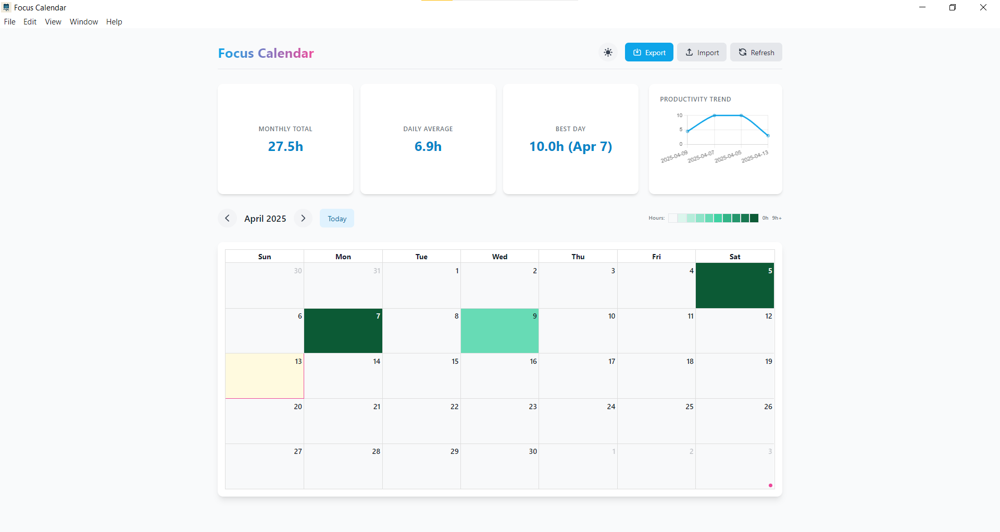
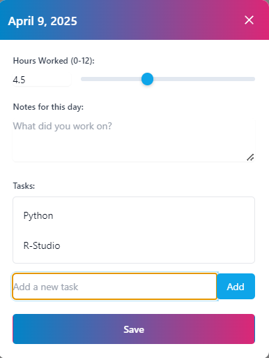

# Focus Calendar Desktop App

A desktop productivity tracking application with calendar visualization, built with Electron.

## Focus Calendar Screenshots





## Project Overview

Focus Calendar is a desktop application designed to help users track and visualize their daily productivity. By providing a color-coded calendar, detailed logging, and insightful statistics, the app makes it easy to monitor and understand your work patterns.

## Key Features

- **Calendar Visualization**: 
  - Color-coded heat map shows productivity at a glance
  - Interactive calendar interface
  - Highlights days with logged hours and tasks

- **Daily Logging**:
  - Quick and easy hour tracking
  - Add detailed notes for each day
  - Flexible logging between 0-12 hours

- **Task Management**:
  - Create tasks for specific dates
  - Mark tasks as complete
  - Delete or modify tasks as needed

- **Productivity Statistics**:
  - Monthly total hours worked
  - Daily average productivity
  - Identify your most productive days
  - Trend visualization with interactive chart

- **Flexible Theming**:
  - Light and dark mode
  - Custom color schemes
  - Responsive design

- **Data Management**:
  - Automatic local file system persistence
  - Import and export functionality
  - Secure data handling

## Technology Stack

- **Framework**: Electron
- **Frontend**: HTML, CSS, JavaScript
- **Styling**: Tailwind CSS
- **Calendar**: FullCalendar
- **Charting**: Chart.js

## Getting Started

### Prerequisites

- [Node.js](https://nodejs.org/) (v14 or newer)
- npm (comes with Node.js)

### Installation

1. Clone the repository:
   ```bash
   git clone https://github.com/yourusername/focus-calendar.git
   cd focus-calendar
   ```

2. Install dependencies:
   ```bash
   npm install
   ```

3. Start the application:
   ```bash
   npm start
   ```

## Usage Guide

### Logging Hours

1. Click on any date in the calendar
2. Use the slider or input field to set hours worked (0-12)
3. Add optional notes about your day
4. Click "Save"

### Managing Tasks

- Add tasks for specific days
- Click a task to toggle completion
- Use the "×" button to delete tasks

### Viewing Statistics

The dashboard provides:
- Total hours worked this month
- Average daily productivity
- Your most productive day

## Data Storage

Application data is stored locally in:
- **Windows**: `%APPDATA%\focus-calendar\data.json`
- **macOS**: `~/Library/Application Support/focus-calendar/data.json`
- **Linux**: `~/.config/focus-calendar/data.json`

## Customization

### Theme Colors

Modify theme colors in `index.html`:

```javascript
tailwind.config = {
    theme: {
        extend: {
            colors: {
                primary: { 500: '#0ea5e9' },
                accent: { 500: '#ec4899' }
            }
        }
    }
}
```

## Project Structure

```
focus-calendar/
├── main.js           # Electron main process
├── preload.js        # Secure API bridge
├── package.json      # Project configuration
├── assets/           # Static assets
└── renderer/
    ├── index.html    # Main HTML file
    └── js/
        ├── app.js    # Application logic
        ├── calendar.js # Calendar functionality
        ├── charts.js   # Visualization
        └── storage.js  # Data management
```

## Development

### Available Scripts

- `npm start`: Run the application in development mode
- `npm run build`: Build for current platform
- `npm run build:mac`: Build for macOS
- `npm run build:win`: Build for Windows
- `npm run build:linux`: Build for Linux

## Contributing

Contributions are welcome! Please feel free to submit a Pull Request.

## License

MIT License

## Acknowledgments

- [Electron](https://www.electronjs.org/)
- [FullCalendar](https://fullcalendar.io/)
- [Chart.js](https://www.chartjs.org/)
- [Tailwind CSS](https://tailwindcss.com/)
